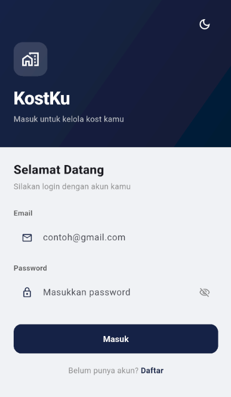
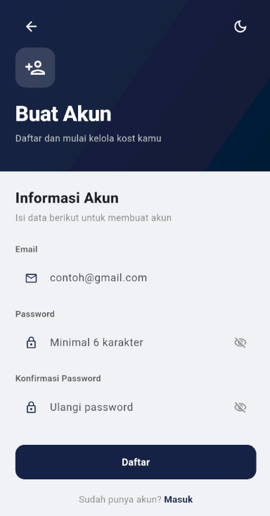
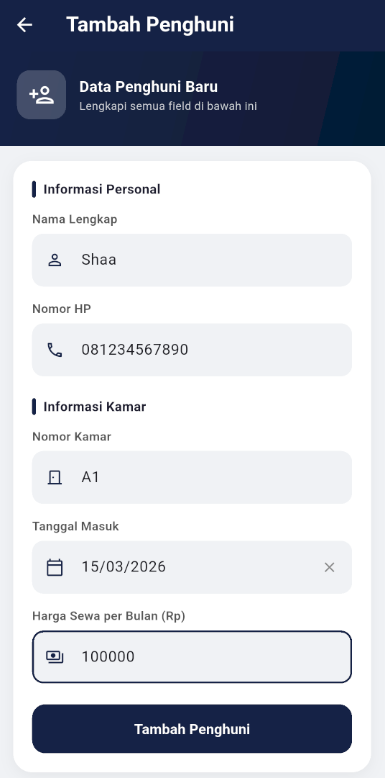
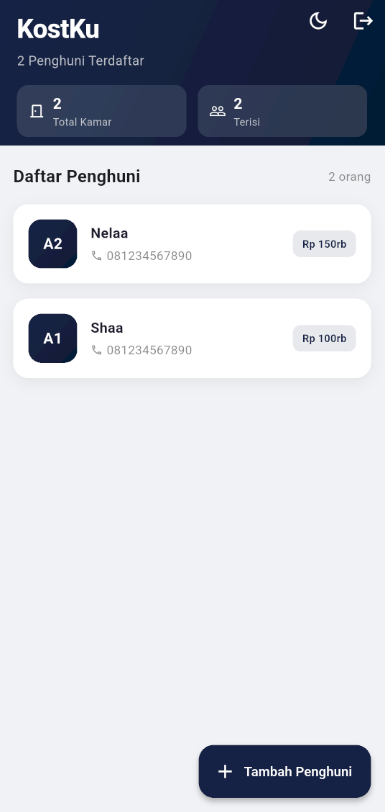
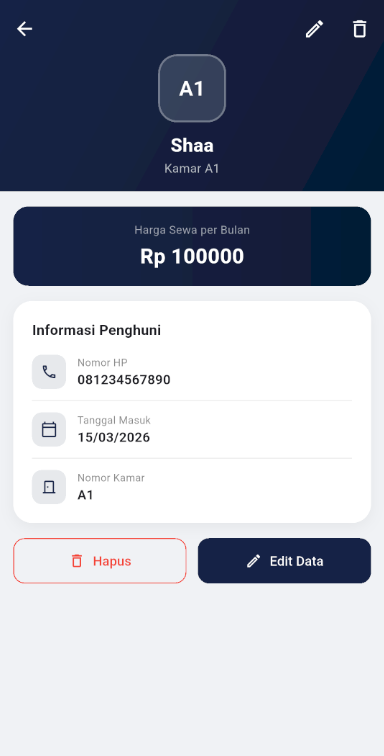
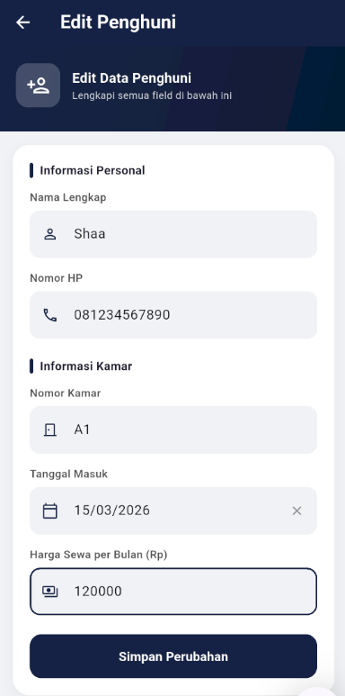

# KostKu 🏠

Aplikasi mobile manajemen penghuni kost berbasis Flutter dengan integrasi Supabase dan autentikasi pengguna. Dirancang untuk membantu pemilik kost dalam mengelola data penghuni secara mudah dan efisien.

---

## Deskripsi Aplikasi

KostKu adalah aplikasi sederhana namun fungsional untuk membantu pemilik kost dalam mencatat dan mengelola data penghuni kost secara digital. Data tersimpan di cloud menggunakan Supabase sehingga dapat diakses kapan saja. Pengguna harus login terlebih dahulu sebelum dapat mengelola data penghuni miliknya.

---

## Fitur Aplikasi

| Fitur | Keterangan |
|---|---|
| 🔐 Register | Membuat akun baru menggunakan email dan password |
| 🔑 Login | Masuk ke akun yang sudah terdaftar via Supabase Auth |
| 🚪 Logout | Keluar dari akun dengan konfirmasi dialog |
| ➕ Tambah Penghuni | Menambahkan data penghuni baru ke Supabase |
| 📋 Lihat Daftar | Menampilkan semua penghuni dari database Supabase |
| 🔍 Detail Penghuni | Melihat informasi lengkap satu penghuni |
| ✏️ Edit Penghuni | Mengubah data penghuni yang tersimpan di Supabase |
| 🗑️ Hapus Penghuni | Menghapus data penghuni dari Supabase dengan konfirmasi dialog |
| 🌙 Dark / Light Mode | Toggle tampilan gelap dan terang |
| ✅ Validasi Input | Nama hanya huruf, HP diawali 08, format kamar A1/B2, harga min Rp 100.000 |
| 📅 Date Picker | Tanggal masuk menggunakan kalender picker |

---

## Struktur Folder

```
minpro_pab2/
├── .env
├── pubspec.yaml
├── Tampilan_aplikasi
└── lib/
    ├── main.dart
    ├── models/
    │   └── penghuni.dart
    ├── services/
    │   └── supabase_service.dart
    ├── pages/
    │   ├── login_page.dart
    │   ├── register_page.dart
    │   ├── home_page.dart
    │   ├── add_edit_page.dart
    │   └── detail_page.dart
    └── widgets/
        └── penghuni_card.dart
```

---

## Widget yang Digunakan

| Widget | Kegunaan |
|---|---|
| `MaterialApp` | Root aplikasi dengan konfigurasi tema global light & dark |
| `Scaffold` | Struktur dasar setiap halaman |
| `CustomScrollView` + `SliverAppBar` | Header expandable di Home & Detail |
| `FlexibleSpaceBar` | Konten dalam SliverAppBar |
| `SliverList` + `SliverFillRemaining` | List penghuni dan tampilan kosong |
| `RefreshIndicator` | Pull to refresh data dari Supabase |
| `GestureDetector` | Mendeteksi tap pada card penghuni |
| `Container` | Styling custom box dengan dekorasi |
| `LinearGradient` | Background gradient warna navy |
| `BoxShadow` | Efek bayangan pada card |
| `Form` + `GlobalKey<FormState>` | Form dengan validasi |
| `TextFormField` | Input field dengan validator |
| `FilteringTextInputFormatter` | Membatasi input sesuai aturan tiap field |
| `showDatePicker` | Kalender picker untuk tanggal masuk |
| `ElevatedButton` + `OutlinedButton` | Tombol aksi simpan, edit, dan hapus |
| `FloatingActionButton.extended` | Tombol tambah penghuni di Home |
| `AlertDialog` | Dialog konfirmasi hapus dan logout |
| `CircularProgressIndicator` | Loading indicator saat fetch/simpan data |
| `Navigator` + `MaterialPageRoute` | Navigasi antar halaman (multi-page) |

---

## Tampilan Aplikasi📲

<details>
<summary>📸 Login</summary>



</details>

<details>
<summary>📸 Register</summary>



</details>

<details>
<summary>📸 Tambah penghuni</summary>



</details>

<details>
<summary>📸 Lihat daftar penghuni</summary>



</details>

<details>
<summary>📸 Detail penghuni</summary>



</details>

<details>
<summary>📸 Edit data penghuni</summary>



</details>

<details>
<summary>📸 Tanggal masuk menggunakan Date Picker</summary>

 

</details>

<details>
<summary>📸 Dark Mode</summary>

 

 

</details>
